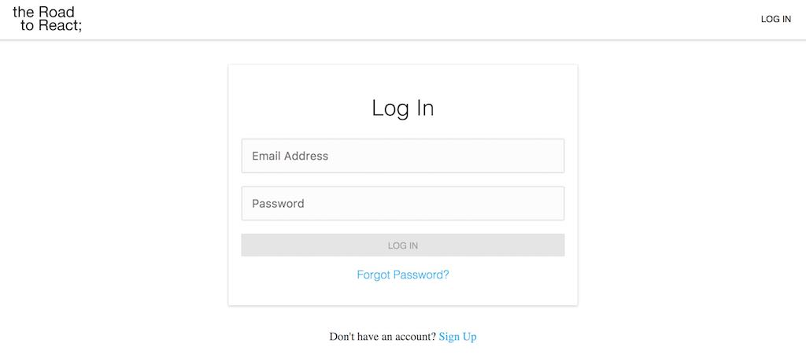
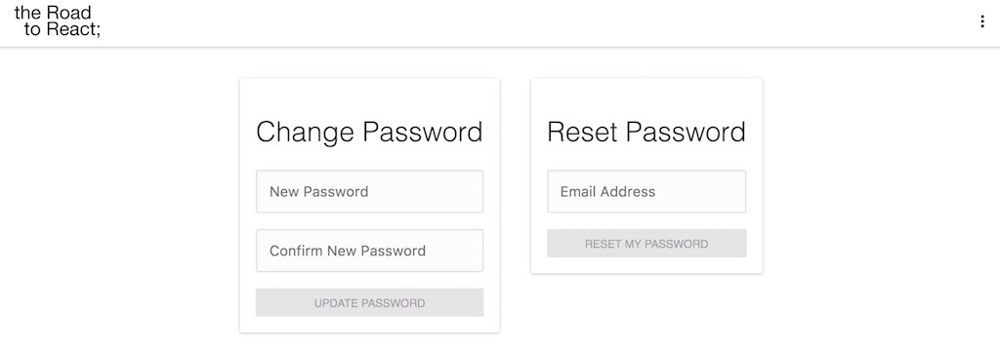

# React Router and Routes

The following application should have multiple routes for the authentication mechanism but also for the application domain itself. Therefore, you can create a file to consolidate all the routes of your application in well-defined constants. Keep it in a constants folder to add more of those files eventually.

{title="Command Line: src/",lang="text"}
~~~~~~~~
mkdir constants
cd constants
touch routes.js
~~~~~~~~

In the newly created file, define all the necessary routes for this tutorial.

{title="src/constants/routes.js",lang=javascript}
~~~~~~~~
export const SIGN_UP = '/signup';
export const SIGN_IN = '/signin';
export const LANDING = '/';
export const HOME = '/home';
export const ACCOUNT = '/account';
export const PASSWORD_FORGET = '/pw-forget';
~~~~~~~~

Each route represents a page in your application. For instance, the sign-up page should be reachable in development mode via *http://localhost:3000/signup* and in production mode via *http://yourdomain/signup*. Let's walk through the routes step by step.

First of all, you will have a **sign-up page** and a **sign-in page**. You can take any web application out there as the blueprint to structure these routes for an authentication mechanism. For instance, take the following scenario: A user visits your web application. The user is convinced by your service and finds the button in the navigation bar to sign in to your application. But the user has no account yet, so a sign-up button is presented as an alternative on the sign-in page.

Second, there will be a **landing page** and a **home page**. The landing page is your root route. That's the place where a user ends up when visiting your web application by default. The user doesn't need to be authenticated to visit this route. On the other hand, the home page is a so-called **protected route**. The user can only access it when being authenticated. You will implement the protection of the route by using authorization in this tutorial.

Third, there will be a protected **account page** as well. On this page, a user can reset a password or change a password. It is secured by authorization as well, and thus only reachable for authenticated.

Last, but not least, the password forget component will be exposed on another non-protected page, a **password-forget page**, as well. It is used for users who are not authenticated and forgot about their password.

Now, all of these routes need to be accessible to the user. How to get started with the routing in React? The best way to start is by implementing a Navigation component which is used in the App component. The App component is the perfect place to render the Navigation component, because it will always render the Navigation component but replace the other components (pages) based on the mapped route. Basically, the App component is the container where all your fixed components are going (navigation bar, side bar, footer) but also your components which are displayed depending on the route in the URL.

First, refactor your App component as follows: It will use the Navigation component and wraps it already in the Router component provided by React Router. The Router makes it possible to navigate from URL-to-URL on the client-side application, without making requests to a web server. Thus, applications need to be requested only once from the server, with the process of handling requested routes handled on the client side.

{title="src/components/App.js",lang=javascript}
~~~~~~~~
import React from 'react';
import { BrowserRouter as Router } from 'react-router-dom';

import Navigation from './Navigation';

const App = () =>
  <Router>
    <Navigation />
  </Router>

export default App;
~~~~~~~~

In addition, you can remove the *logo.svg* image, because it isn't used anymore. Moreover, it is up to you to keep the *App.css* file up to date, to enhance your application's appearance, as we proceed through this tutorial.

{title="Command Line: src/components/",lang="text"}
~~~~~~~~
rm logo.svg
~~~~~~~~

Second, create the Navigation file on the command line.

{title="Command Line: src/components/",lang="text"}
~~~~~~~~
touch Navigation.js
~~~~~~~~

And third, implement the Navigation component. It uses the Link component of React Router to link the application to different routes. These routes were defined previously in your constants file.

{title="src/components/Navigation.js",lang=javascript}
~~~~~~~~
import React from 'react';
import { Link } from 'react-router-dom';

import * as routes from '../constants/routes';

const Navigation = () =>
  

    <ul>
      <li><Link to={routes.SIGN_IN}>Sign In</Link></li>
      <li><Link to={routes.LANDING}>Landing</Link></li>
      <li><Link to={routes.HOME}>Home</Link></li>
      <li><Link to={routes.ACCOUNT}>Account</Link></li>
    </ul>
  

export default Navigation;
~~~~~~~~

Now, run your application again and verify two things: The links need to show up in your browser; and once you click a link, the URL has to change. However, even though the URL changes, the displayed content doesn't change. Let's implement this behavior.

In your App component, you can specify which components should show up according to corresponding routes with the help of the Route component from React Router.

{title="src/components/App.js",lang=javascript}
~~~~~~~~
import React from 'react';
import {
  BrowserRouter as Router,
# leanpub-start-insert
  Route,
# leanpub-end-insert
} from 'react-router-dom';

import Navigation from './Navigation';
# leanpub-start-insert
import LandingPage from './Landing';
import SignUpPage from './SignUp';
import SignInPage from './SignIn';
import PasswordForgetPage from './PasswordForget';
import HomePage from './Home';
import AccountPage from './Account';
# leanpub-end-insert

# leanpub-start-insert
import * as routes from '../constants/routes';
# leanpub-end-insert

const App = () =>
  <Router>
# leanpub-start-insert
    

# leanpub-end-insert
      <Navigation />

# leanpub-start-insert
      

      <Route
        exact path={routes.LANDING}
        component={() => <LandingPage />}
      />
      <Route
        exact path={routes.SIGN_UP}
        component={() => <SignUpPage />}
      />
      <Route
        exact path={routes.SIGN_IN}
        component={() => <SignInPage />}
      />
      <Route
        exact path={routes.PASSWORD_FORGET}
        component={() => <PasswordForgetPage />}
      />
      <Route
        exact path={routes.HOME}
        component={() => <HomePage />}
      />
      <Route
        exact path={routes.ACCOUNT}
        component={() => <AccountPage />}
      />
    

# leanpub-end-insert
  </Router>

export default App;
~~~~~~~~

So if a route matches a path, the respective component will be displayed. Thus all the page components in the App component are exchangeable by changing the route, but the Navigation component stays fixed independently of any route change. Next, you have to create all these page components. You can do it again on the command line.

{title="Command Line: src/components/",lang="text"}
~~~~~~~~
touch Landing.js Home.js Account.js SignUp.js SignIn.js SignOut.js PasswordForget.js PasswordChange.js
~~~~~~~~

In each component, define a simple boilerplate component as functional stateless component. That's sufficient for now. These components will be filled with business logic later on. For instance, the component for the Landing page could be defined as follows.

{title="src/components/Landing.js",lang=javascript}
~~~~~~~~
import React from 'react';

const LandingPage = () =>
  

    <h1>Landing Page</h1>
  

export default LandingPage;
~~~~~~~~

After you have done so for the other pages, you should be able to start the application again. Now, when you click through the links in the Navigation component, the displayed page component should change accordingly to the URL. Note that the routes for the PasswordForget page, PasswordChange page and SignUp page are not used yet but will be defined somewhere else later on. For now, you have successfully implemented the larger part of the routing for this application.
